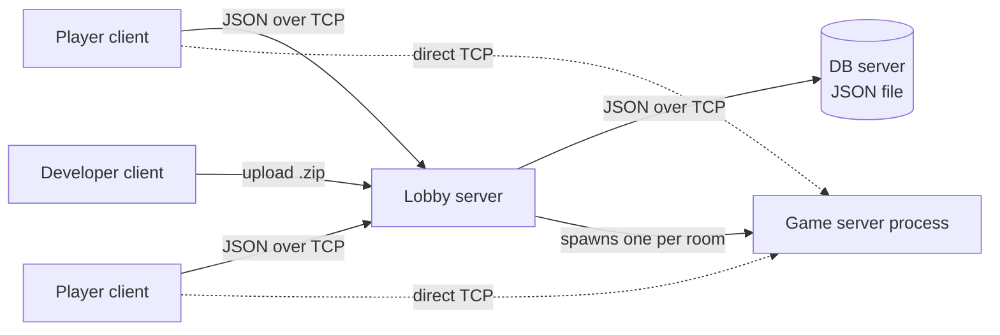

# Online Game Platform

A multiplayer game platform built on raw TCP sockets: a lobby with accounts, a game store where developers publish games, rooms that launch a dedicated game server when they fill up, and four networked games.

*Individual course project — Network Programming, NYCU, Fall 2025.*

## Highlights

- **Three-tier server design.** A DB server owns all persistent state, a lobby server handles every client request, and each room gets its own game server process spawned on demand.
- **Custom wire protocol.** Every message is a 4-byte big-endian length prefix followed by UTF-8 JSON; game packages are streamed as length-prefixed binary.
- **Game-agnostic plugin format.** A game ships a `game_config.json` that tells the platform how to start its server and client and how to map runtime values (port, player IDs, room ID) onto its own command-line flags. The platform runs any game that follows this format without code changes.
- **Developer workflow.** Separate developer accounts, config validation before upload, automatic version bump on each upload, and only a game's author can update or remove it.
- **Player workflow.** Browse the store with ratings and reviews, install and update games (installed vs. latest version is shown), create or join rooms, and the game launches automatically on every player's machine once the room is full. Reviews are accepted only from players who have actually played the game.

## Architecture



**Room lifecycle**

1. A player creates a room for an installed game; other players join it.
2. When the room is full, the lobby extracts that game's package, picks a free port, and starts the game server with arguments built from the game's `game_config.json`.
3. The lobby records the match in each player's play history, then pushes a start packet (host, port, player list) to every player in the room.
4. Each player client launches its local copy of the game client, which connects directly to the game server.

## Included games

| Game | Players | Client | Notes |
|---|---|---|---|
| Click War | 2–3 | pygame | First to 50 presses of Space wins |
| Tetris Battle | 2 | pygame | Server-authoritative board state; separate spectator client |
| Dice Battle | 3 | pygame | Everyone rolls five dice per round, over three rounds |
| Num Guess | 2–3 | terminal | Guess a hidden number from 1–100 with higher/lower hints |

## Quick start (local)

Requires Python 3.10+ and pygame.

```bash
pip install pygame
```

Run each command from the repository root, in its own terminal:

```bash
# 1. Database server (default port 10001)
python db_server/db_server.py

# 2. Lobby server (default port 10002)
python lobby_server/lobby_server.py --public-host 127.0.0.1

# 3. Publish games: register a developer account, choose "upload",
#    then enter a game folder such as games/click_war
python developer_client.py

# 4. Players: open two or more of these, register, download a game
#    from the store, then have one player create a room and the others join
python player_client.py
```

Uploading bumps the patch version and writes it back to that game's `game_config.json`. On Windows, each game window opens in its own console.

## Protocol

Clients and the lobby exchange request/response messages:

```text
[4-byte length, big-endian][UTF-8 JSON]

request:  {"action": "auth_login", "data": {"username": "alice", "password": "..."}}
response: {"status": "success", "data": {...}}   or   {"status": "error", "message": "..."}
```

`upload_game` and `download_game` send the JSON header first and then the `.zip` package as a second length-prefixed frame. The lobby forwards account, store, room and review actions to the DB server using the same framing.

## Game package format

A game is a folder with its server and client scripts plus a `game_config.json`:

```json
{
  "meta": {
    "game_name": "Click_War",
    "version": "1.0.12",
    "description": "...",
    "min_players": 2,
    "max_players": 3
  },
  "execution": {
    "server": {
      "script": "server.py",
      "arguments": { "port": "--port", "users": "--users" }
    },
    "client": {
      "script": "client.py",
      "arguments": { "host": "--host", "port": "--port", "user_id": "--user-id" }
    }
  }
}
```

`arguments` maps a platform value to the flag the game expects, so `"port": "--port"` becomes `--port 37060` at launch.

## Project structure

```text
.
├── player_client.py        # Player CLI: account, store, reviews, rooms, auto-launch
├── developer_client.py     # Developer CLI: upload, update, remove games
├── lobby_server/           # Request handling, file transfer, game server launcher
├── db_server/              # Users, games, rooms, reviews, play history (JSON file)
├── utils/protocol.py       # Length-prefixed JSON messages and file frames
└── games/
    ├── click_war/
    ├── tetris_battle/
    ├── dice_battle/
    └── num_guess/
```

Runtime data (`db_clean.json`, `server_storage/`, `server_running/`, `downloads/`) is created on first run and ignored by git.

## Deployment note

For the course, the servers ran on the department's Linux workstation. Only a few ports were reachable through its firewall, so that build pinned game servers to fixed ports, and players connected through SSH local port forwarding:

```bash
ssh -L 10002:127.0.0.1:10002 -L <game-port>:127.0.0.1:<game-port> <user>@<workstation>
python player_client.py --host 127.0.0.1 --port 10002
```

## Known limitations

- Passwords are stored in plain text, and traffic is not encrypted.
- The DB is a single JSON file behind one lock, which is fine at course scale but does not scale to many concurrent writes.
- Click War sends each key press as a raw user ID without message framing, so very fast presses can be merged into one TCP read and dropped.
